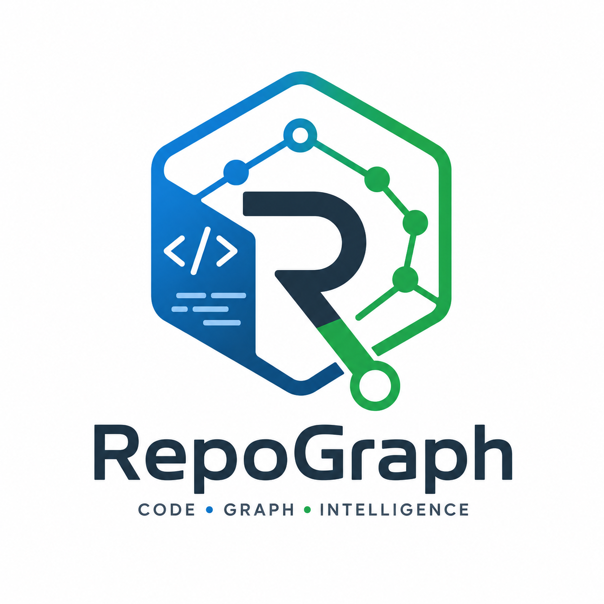
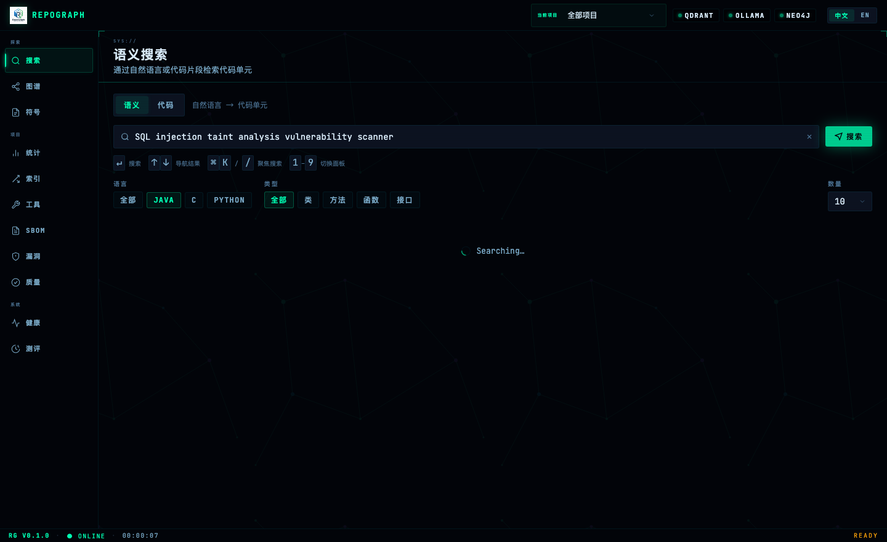
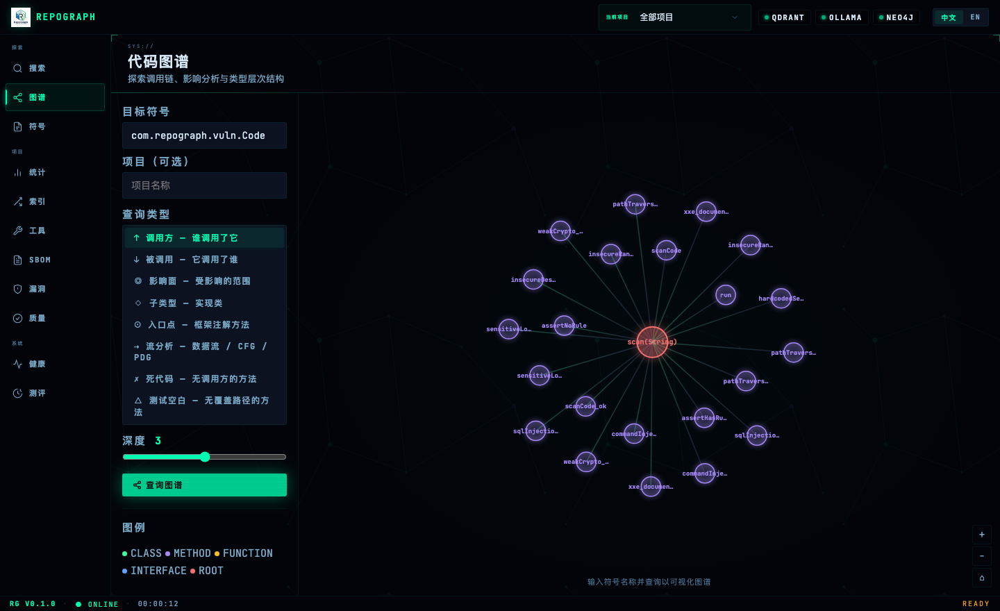
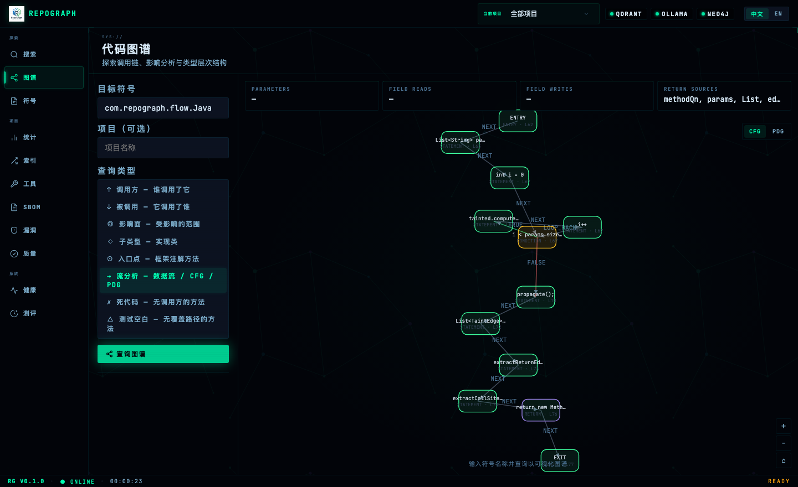
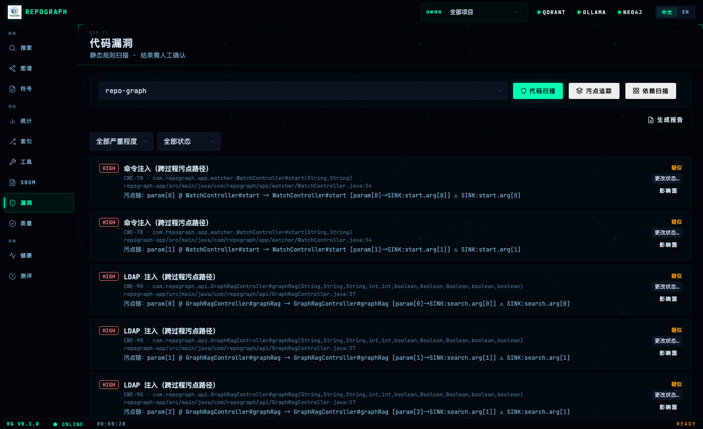

<div align="right">

[English](README.en.md)

</div>

<div align="center">
  
</div>

<div align="center">

[](LICENSE)
[](https://openjdk.org/)

</div>

# RepoGraph

本地代码知识图谱与语义分析工具，面向静态启发式代码分析。完全本地运行，代码不出内网。

- **语义 / 相似检索**：自然语言或代码片段查找实现，Markdown 文档一并参与检索
- **代码图分析**：调用链、影响面、继承图，基于接收者类型的精确调用解析
- **流分析**：Java 方法级 CFG / PDG / 数据流摘要，跨过程污点追踪
- **漏洞管理**：代码规则 / 依赖 CVE / 污点扫描三路互补，发现记录走状态机确认
- **质量与 SBOM**：圈复杂度、耦合、包循环、Git 热点、健康分；Maven/Gradle/npm/pip → CycloneDX
- **AI 集成**：MCP stdio 服务，把 GraphRAG / Context Pack / 研判能力暴露给编码 Agent

**技术栈**：Java 25，Spring Boot 3.x，Gradle（Kotlin DSL）
**解析目标**：Java / C / Python 源码 + Markdown + Java 字节码（可选）
**存储后端**：[Qdrant](https://qdrant.tech/)（向量）、[Neo4j](https://neo4j.com/)（图）、[Ollama](https://ollama.ai/)（Embedding）、SQLite（增量缓存）

> 详细使用说明见 **[用户手册](docs/user-manual.md)**（前置依赖 / 配置 / REST API / MCP 工具完整参考）。

---

## 项目定位

RepoGraph 的终极方向是成为 **LLM Agent 的上下文提供者**：让 Agent 在大型代码库中以工具调用方式按需定位上下文，而不是把整个仓库塞进上下文窗口。近期产品主线收敛为**面向企业研发安全团队的 AI Native SAST 报警研判 Agent**——接入 CodeQL / Semgrep / SonarQube / SCA 等扫描结果，把报警转化为可解释、可验证、可修复的研判报告。

当前阶段以**独立代码审计平台**形态交付：所有分析能力先在平台（Web 控制台 / REST）上完成开发与验证，再逐步暴露为 MCP 工具（进度见[开发计划](#开发计划)）。

**能力边界**：面向静态启发式分析，不做完整编译器语义分析——粗中粒度对检索与审计够用；需要更高精度的场景通过 CodeQL 等外部扫描器接入。

---

## 核心优势

- **完全本地，数据零上云** — 解析、向量化、检索均在本机，代码不经外部 API，适合私有代码库与隔离内网。
- **GraphRAG 一次调用** — 向量种子 + 关键词种子 → 调用图展开 → 影响面扩展 → 安全感知重排序，四阶段合并为一次 API，全程无需 LLM。
- **结构化 Chunk，三层语义文本** — 类级 Javadoc/注解 + 方法 Javadoc + 方法签名叠加，让自然语言查询命中私有/包级方法；语义与代码相似双向量互不干扰。
- **增量索引** — 文件级 MD5 缓存，改一个文件只重建一个文件，百万行代码库增量更新秒级完成。
- **框架感知** — 自动识别 Spring MVC / JAX-RS / MyBatis 注解并标记入口点，无需手工标注。
- **漏洞管理三路互补** — 静态规则（快）+ 跨过程污点（源码级）+ 离线 CVE，发现记录走状态机确认，完全离线。

---

## 项目能力

| 能力域 | 能力 |
| --- | --- |
| 代码解析 | Java（AST）、C / Python（Tree-sitter，失败自动降级）、Java 字节码（可选）、Markdown 文档（按 H1-H3 切为 DOCUMENT 单元） |
| 索引 | 增量索引（文件级缓存）、文件监听自动更新、多项目隔离管理 |
| 向量检索 | 语义搜索（NL → 代码）、代码相似搜索（片段 → 实现） |
| GraphRAG | Hybrid 种子召回（向量 + 关键词）、关键词 BM25-like 检索、调用图展开、影响面扩展、安全感知重排序 |
| 符号 / 代码图 | 符号详情与定位、自动补全、调用链、影响面、类型层次，全部支持 `projectId` 过滤 |
| 流分析 | 数据流摘要、Java 方法级 CFG / PDG、跨过程污点追踪 |
| 框架分析 | Spring MVC / JAX-RS / MyBatis 入口点识别与标记 |
| 漏洞 | 代码扫描（9 条 CWE 规则）、源码级污点扫描、依赖 CVE（离线 Advisory） |
| 质量指标 | 圈复杂度 / 耦合 / 包循环（Tarjan SCC）/ Git 热点、六维度健康报告 |
| SBOM | Maven / Gradle / npm / pip → CycloneDX JSON |
| 可视化 | Web 控制台（`http://localhost:8080`）、包级依赖图导出（DOT / Mermaid，循环高亮） |
| AI 集成 | MCP stdio 服务（`repograph-mcp`，23 个工具） |
| 质量评测 | 检索 Benchmark（Hit@K、MRR@10、HitScore + 阈值门禁） |

> 流分析：Java 支持 CFG + PDG + 污点摘要（精确 AST）；C / Python 仅 CFG + 保守数据流摘要。数据依赖为保守启发式，不构建 SSA。
> 各能力的调用入口与参数见[用户手册](docs/user-manual.md)。

---

## 界面截图

| 语义搜索 | 代码图谱 |
| --- | --- |
|  |  |
| **流分析（CFG / PDG）** | **漏洞面板** |
|  |  |

---

## 模块结构

两个 Gradle 子项目：

```
repograph-app/   Spring Boot Web 服务（REST API、索引管道、检索）
  ├─ core/        领域模型 + 接口定义（CodeUnit / VectorStore / GraphQueryService）
  ├─ parser/      JavaParser AST、Tree-sitter FFM（C/Python）、Markdown、启发式状态机
  ├─ graph/       Neo4j Bolt 门面（调用链 / 影响面 / 继承图）
  ├─ vector/      Qdrant gRPC（向量）+ Ollama（Embedding）
  ├─ flow/        函数内 CFG / PDG / 数据流摘要 + 跨过程污点分析
  ├─ retrieval/   GraphRAG + 关键词召回 + 安全感知重排序 + Context Pack
  ├─ framework/   Spring / JAX-RS / MyBatis 注解识别，标记入口点
  ├─ sbom/        Maven / Gradle / npm / pip → CycloneDX JSON
  ├─ vuln/        漏洞扫描（代码规则 / 污点 / 依赖 CVE）+ 发现记录状态机
  ├─ metrics/     圈复杂度 / 耦合 / 包循环 / Git 热点 / 健康报告
  ├─ export/      包级依赖图导出（DOT / Mermaid）
  ├─ api/         Spring MVC REST 控制器
  └─ app/         索引管道 + Spring Boot 入口

repograph-mcp/          独立 MCP stdio 服务（供 AI 工具调用，HTTP 转发至 repograph-app）
```

---

## 前置依赖

| 服务 | 启动方式 |
|------|----------|
| **Qdrant** | `docker run -d -p 16333:6333 -p 16334:6334 qdrant/qdrant` |
| **Neo4j** | `docker run -d -p 7474:7474 -p 7687:7687 -e NEO4J_AUTH=neo4j/neo4jneo4j neo4j:5` |
| **Ollama** | 本机或远端启动，拉取模型 `ollama pull manutic/nomic-embed-code` |
| **JDK 25** | 需开启 `--enable-native-access=ALL-UNNAMED`（Tree-sitter FFM） |

---

## 快速上手

```bash
# 1. 构建
./gradlew build -x test        # 跳过测试快速构建

# 2. 启动 REST 服务
java --enable-native-access=ALL-UNNAMED \
  -jar repograph-app/build/libs/repograph-app-0.5.0.jar

# 3. 索引项目（异步，返回 202；用 status 轮询进度）
curl -X POST "http://localhost:8080/api/v1/index/project" \
  -H "Content-Type: application/json" \
  -d '{"projectRoot": "/path/to/your/project"}'

# 4. 语义检索
curl "http://localhost:8080/api/v1/search/semantic?q=HTTP+REST+endpoint+handler&lang=java&limit=10"
```

配置见 `repograph-app/src/main/resources/application.yml`，完整字段说明见[用户手册 §4](docs/user-manual.md)。

**构建产物**：
- `repograph-app/build/libs/repograph-app-0.5.0.jar` — Web / REST 服务
- `repograph-mcp/build/libs/repograph-mcp-exec.jar` — MCP stdio 服务

**检索 Benchmark**（需先建索引，Qdrant + Ollama 在线）：

```bash
./gradlew :repograph-app:test --tests "*.benchmark.*"
# 指标 Hit@1/3/5/10、MRR@10、HitScore；Hit@10 低于阈值（语义 65% / 代码 75%）测试失败
```

---

## REST API

核心端点如下，完整清单（含漏洞、资产、扫描器、研判等）见[用户手册 §5](docs/user-manual.md)。

| 方法 | 路径 | 说明 |
|------|------|------|
| `POST` | `/api/v1/index/project` | 异步启动索引（返回 202） |
| `GET` | `/api/v1/search/semantic` | 自然语言语义检索 |
| `GET` | `/api/v1/search/graphrag` | GraphRAG 检索（向量 + 调用图 + 影响面 + 安全重排序） |
| `GET` | `/api/v1/context/pack` | 构建带 citation 的 Agent 上下文包 |
| `GET` | `/api/v1/graph/callers` `/callees` `/impact` `/subtypes` | 调用图查询 |
| `GET` | `/api/v1/flow/analyze` `/flow/taint` | 流分析与跨过程污点 |
| `GET` | `/api/v1/metrics/report` | 代码健康报告（六维度 + 健康分） |
| `POST` | `/api/v1/vulns/scan/{code,taint,deps}` | 三路漏洞扫描 |

---

## GraphRAG 检索

`GET /api/v1/search/graphrag` 是高质量代码检索的推荐入口，将四个阶段串联为一次调用，全程无需 LLM：

```
自然语言查询
  └─ 1. Code Structure Chunking（索引阶段，三层语义文本）
       └─ 2. Call Graph Retrieval（向量/关键词种子 → callers + callees 展开）
            └─ 3. Impact Expansion（影响面展开，仅安全相关节点）
                 └─ 4. Security-aware Rerank（静态信号评分 + finalScore 重排）
```

安全评分基于入口点、认证授权、SQL/命令执行、反序列化、加密等静态信号加权，`finalScore = vectorScore + 0.5 × securityScore`。参数、返回结构与完整评分表见[用户手册](docs/user-manual.md)。

---

## MCP 服务（AI 工具集成）

RepoGraph 提供 MCP stdio 服务，可接入 Cursor 等任何支持 MCP 协议的 AI 工具。

```json
{
  "mcpServers": {
    "repograph": {
      "command": "java",
      "args": ["-jar", "/path/to/repograph-mcp-exec.jar", "--base-url", "http://localhost:8080"]
    }
  }
}
```

23 个工具按域分组：

- **检索** — `search_semantic` / `search_keyword` / `search_code` / `search_graphrag` / `build_context_pack`
- **代码图** — `lookup_symbol` / `locate_at` / `find_callers` / `find_callees` / `get_impact` / `find_subtypes` / `find_entrypoints`
- **流 / 漏洞** — `analyze_flow` / `trace_taint` / `scan_vuln_code` / `list_vulns` / `get_health_report`
- **SAST 研判** — `triage_finding`（导入 Semgrep/SARIF/CodeQL 并生成研判报告）/ `record_triage_feedback` / `list_triage_feedback`
- **项目管理** — `list_projects` / `trigger_index` / `index_status`

工具参数详见[用户手册](docs/user-manual.md)。

---

## 漏洞管理

> **状态**：已实现（v0.5.0）。在 GraphRAG 安全基础设施之上构建，完全本地，无需联网。

三条互补扫描路径，均写入同一发现记录存储：

| 扫描器 | 原理 | 速度 | 适用 |
|--------|------|------|------|
| 代码扫描 | 方法内字符串规则（9 条 CWE：SQL/命令注入、XXE、弱加密、硬编码密钥、路径穿越、不安全反序列化/随机数、敏感日志） | 快 | 快速普查，有误报 |
| 污点扫描 | 跨过程污点追踪（HTTP 入口 → Sink，源码级启发式） | 慢 | 多跳污点链 |
| 依赖扫描 | SBOM × 离线 CVE Advisory | 快 | 依赖 CVE |

发现记录走状态机 `SUSPECTED → CONFIRMED → FIXED / DISMISSED`，`CONFIRMED` 后才计入报告；结合图遍历输出调用链影响面。

---

## 开发计划

后续产品主线收敛为**面向企业研发安全团队的 AI Native SAST 报警研判与修复 Agent**：不从零重做扫描器，而是接入现有 SAST / SCA / CI 报警，转化为可解释、可验证、可修复、可闭环的研判报告。完整路线见 [roadmap-codesec-triage-agent.md](docs/generated/roadmap-codesec-triage-agent.md)。

```
第一阶段（已完成） 独立代码审计平台 —— 在平台上完成并验证基础分析能力
第二阶段（进行中） LLM Agent 上下文提供者 —— GraphRAG / Context Pack / 漏洞管理暴露为 MCP 工具
第三阶段（规划中） SAST 报警研判 Agent —— 接入外部报警，生成证据链、误报判断与修复建议
```

**第二阶段已完成**：`search_graphrag` / `search_keyword` / `build_context_pack` / `triage_finding` MCP 工具、研判反馈闭环、安全与 Agent 定向工具。
**待开发**：持久化 BM25 / FTS、分层摘要、引用校验、跨子项目调用解析、Go 语言支持。

**第三阶段**分 P0–P4：报警解释器 → 误报研判 → PR/CI 集成 → 修复闭环 → 企业化。本地 PRD 与任务清单见 `.scratch/codesec-triage-agent/`。

---

## 已知局限

- 无完整 classpath，外部依赖源码缺失时调用目标解析可能失败
- Lombok / annotation processor 生成代码不可靠；反射、动态代理调用无法静态追踪
- C 预处理器宏展开、条件编译、函数指针调用不做精确解析
